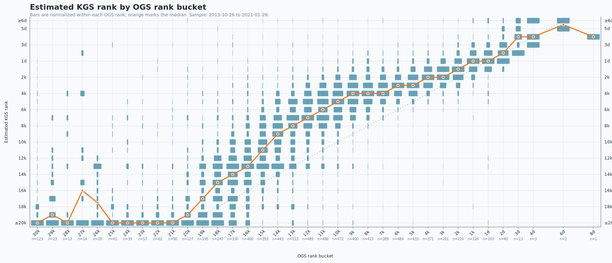
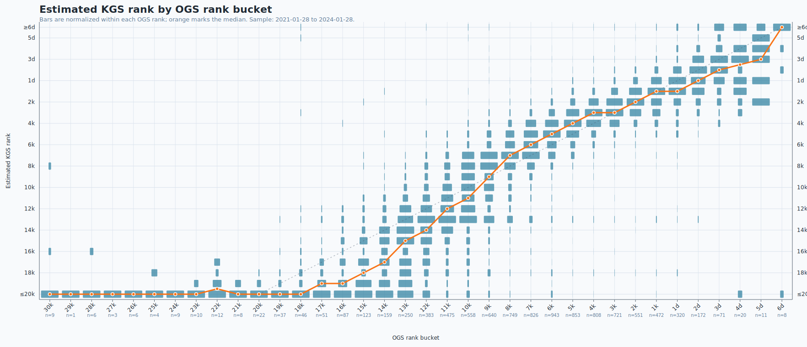
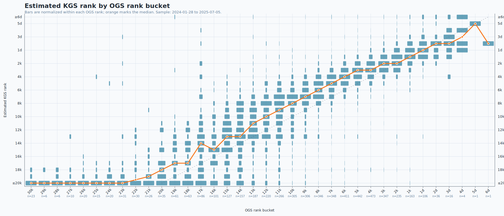
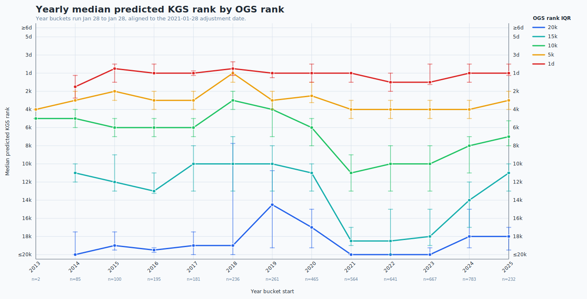

# Measuring OGS ranks with KataGo HumanSL

KataGo is usually thought of as a superhuman Go engine, but the interesting
piece for this project is one of its side models: the
[Human SL network](https://katagotraining.org/extra_networks/). David Wu
(`lightvector`) released it with
[KataGo v1.15.0](https://github.com/lightvector/KataGo/releases/tag/v1.15.0)
after training it on a large collection of human games, with the goal of
predicting human moves across ranks and time periods.

For a board position and the move history that led to it, the HumanSL policy can
be read as a probability distribution over moves: "how likely is a player with
this profile to play here?" KataGo exposes that distribution as `humanPolicy`
when the analysis engine is run with a HumanSL model and a `humanSLProfile`.
Those profiles include rank-like conditioners such as `rank_20k` through
`rank_9d`, historical-style profiles such as `preaz_5k`, and pro-year profiles
such as `proyear_1950`; the example GTP config also shows how these profiles are
used for human-like play.

This repo is a data analysis project built on top of that idea. The reusable,
app-oriented rank estimator lives in
[`djma/rankmle`](https://github.com/djma/rankmle); this repository applies the
same maximum-likelihood approach to a filtered OGS sample and plots the result.

## The method

For each game position, I ask the HumanSL model the same question many times:
what probability would each rank profile assign to the move that was actually
played?

The code scans KGS-style profiles from `rank_20k` to `rank_6d`. For each player,
it sums the log probability of that player's actual moves under each profile.
The selected rank is the maximum-likelihood estimate: the profile under which
the player's move sequence was least surprising.

This is not a claim that KGS is the best rank scale. It is a practical
choice inherited from HumanSL's public rank profiles and release discussion:
KataGo's default rank-style HumanSL configuration is commonly described as
KGS-based, while the model also has experience with other servers. I could in
principle repeat the same procedure over another server's rank metadata.
For now, I use the KGS profile axis as a fixed ruler.

There is one important caveat. HumanSL's training data is only partially public,
and the KGS portion used for these rank profiles is not. That means I cannot
easily run this estimator back over the KGS training data to check whether KGS
ranks were stationary across the whole training period. Even so, the trained
model is still a consistent judge in the narrower sense used here: every OGS game
is measured against the same frozen set of HumanSL rank profiles.

## The OGS sample

The games come from [za3k's OGS archive](https://za3k.com/ogs/), which includes
large OGS JSON and SGF dumps redistributed with permission. This run uses the
100k random JSON sample, then filters down to games that are:

- ranked, human-vs-human, 19x19 games;
- at least 150 moves long;
- handicap 0, 1, or 2;
- byoyomi games with 15-40 minutes main time, 3-8 overtime periods, and
  30-second periods.

The current result CSV has 11,136 games, or 22,272 player estimates, ranging
from 2013-10-26 through 2025-07-05. I do not yet have data after 2025-07.

OGS changed its rating and rank system on
[2021-01-28](https://forums.online-go.com/t/2021-rating-and-rank-adjustments/33389).
The announcement says players should expect a rank bump, especially at weaker
ranks, and explains that the new rating-to-rank formula was meant to improve
alignment and handicap consistency. So the plots below split the data around
that date.

## What the plots show

Before the 2021 adjustment, OGS ranks below about 5 kyu were very tough. Many
double-digit kyu OGS players were estimated by HumanSL as much stronger on the
KGS-style axis.



From 2021 through 2024, the system looks much closer to the HumanSL KGS-style
scale. The lower kyu ranks move toward the diagonal, and the median estimates
are less severely compressed.



In the 2024-2025 slice, the lower ranks appear to be drifting harder again. The
effect is not as extreme as the pre-2021 data, and the sample is shorter, but the
direction is visible.



The yearly medians tell the same story more compactly: a sharp correction around
the 2021 adjustment, then a later bend suggesting renewed rank deflation,
especially below single-digit kyu.



## Reproducing the run

The RunPod setup script downloads KataGo, the normal KataGo model, the HumanSL
model, and za3k's 100k OGS sample:

```bash
scripts/package_for_runpod.sh
# upload ogs-rank-analysis-runpod.tgz to /workspace, then on the pod:
bash scripts/setup_runpod_pod.sh
```

The core local steps are:

```bash
python3 tools/jsonl_to_sgfs.py \
  data/sample-100k.json.gz \
  data/sample-100k-medium-ranked-19x19-human-150moves-sgfs \
  --medium-ranked-19x19 \
  --human-vs-human \
  --min-moves 150

PYTHONPATH=tools python3 tools/analyze_rank_mle_dataset.py \
  --katago /path/to/katago \
  --model /path/to/kata1-main-model.bin.gz \
  --human-model /path/to/b18c384nbt-humanv0.bin.gz \
  --config configs/analysis_config.optimized.cfg \
  --sgf-dir data/sample-100k-medium-ranked-19x19-human-150moves-sgfs \
  --output results/sample_100k_150moves_rank_mle_runpod.csv
```

Then regenerate plots with:

```bash
python3 tools/plot_rank_histogram.py results/sample_100k_150moves_rank_mle_runpod.csv \
  -o results/ogs_rank_hist_pre2021.svg \
  --end-date adjust2021

python3 tools/plot_rank_histogram.py results/sample_100k_150moves_rank_mle_runpod.csv \
  -o results/ogs_rank_hist_2021_2024.svg \
  --begin-date adjust2021 \
  --end-date 2024-01-28

python3 tools/plot_rank_histogram.py results/sample_100k_150moves_rank_mle_runpod.csv \
  -o results/ogs_rank_hist_post2024_2025.svg \
  --begin-date 2024-01-28

python3 tools/plot_rank_yearly_medians.py results/sample_100k_150moves_rank_mle_runpod.csv \
  -o results/ogs_rank_yearly_medians.svg
```

## Sources

- [KataGo Extra Networks](https://katagotraining.org/extra_networks/)
- [KataGo v1.15.0 HumanSL release notes](https://github.com/lightvector/KataGo/releases/tag/v1.15.0)
- [KataGo Analysis Engine Human SL guide](https://github.com/lightvector/KataGo/blob/master/docs/Analysis_Engine.md#human-sl-analysis-guide)
- [KataGo human 5k example config](https://github.com/lightvector/KataGo/blob/master/cpp/configs/gtp_human5k_example.cfg)
- [KataGo v1.15.x release discussion](https://www.reddit.com/r/baduk/comments/1e7mjxx/katago_v115x_new_humanlike_play_and_analysis/)
- [za3k OGS archive](https://za3k.com/ogs/)
- [2021 OGS rating and rank adjustment announcement](https://forums.online-go.com/t/2021-rating-and-rank-adjustments/33389)
